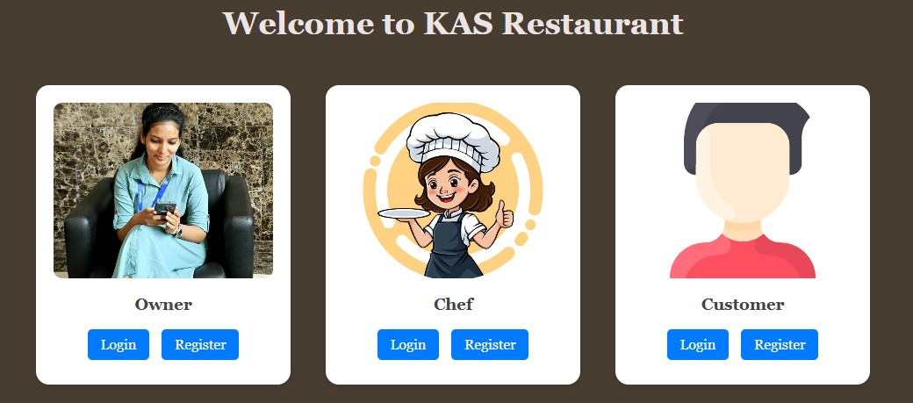
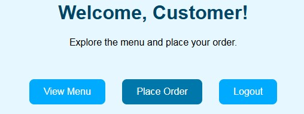
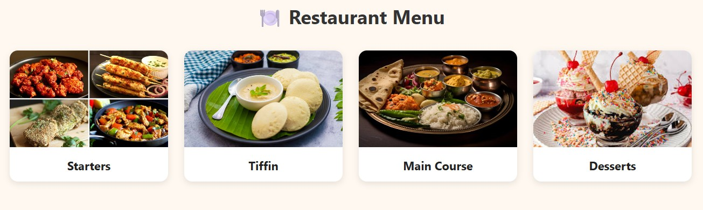
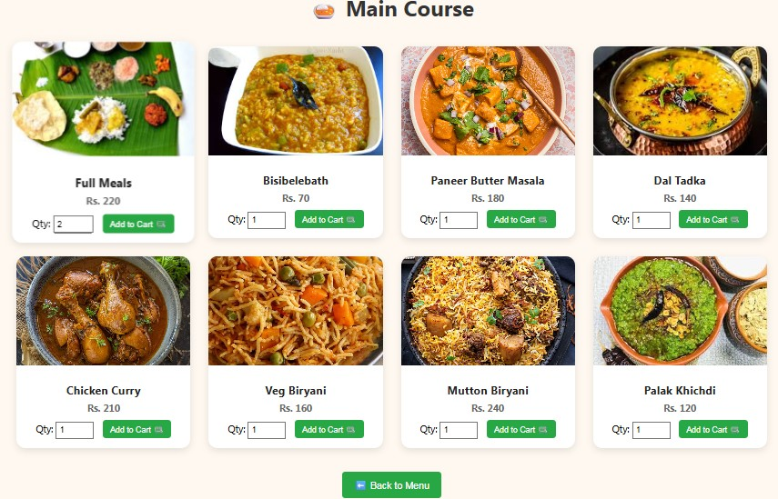

# 🍽️ Restaurant Management Web Application

**Live Demo:** [Click here to view the application](https://restaurant-management-web-application.onrender.com)  
**GitHub Repository:** [View Source Code](https://github.com/SangeethaA2000/Restaurant_Management_Web_Application)

---

## 📖 Overview
The **Restaurant Management Web Application** is a Flask-based web solution designed to streamline restaurant operations.  
It provides **role-based access** for **Owners, Chefs and Customers** enabling tasks like:
- Managing customers, tables, and menu
- Placing and tracking orders
- Viewing order status and summaries
- Shopping cart with quantity-based billing

This project integrates **SQLite** for persistent data storage and uses **Flask** for backend routing, **HTML5/CSS** for front-end, and **Jinja2 templates** for dynamic rendering.

---

## 🚀 Features

### 👤 Role-based Access
- **Owner:** Manage menu, tables, and view order summaries.
- **Chef:** View and update order status.
- **Customer:** Browse menu, place orders, and view cart.

### 📦 Core Functionalities
- **Customer Management:** Add and track customer details.
- **Menu Display:** Category-wise menu (Starters, Tiffin, Main Course, Desserts).
- **Order Placement:** Customizable order options (spice level, sweetness, texture).
- **Cart Management:** Add, update, and clear items.
- **Order Tracking:** View live status and summaries.
- **Table Management:** Track availability and auto-update when served.

---

## 🛠️ Tech Stack
- **Frontend:** HTML5, CSS, Jinja2 Templates
- **Backend:** Python Flask
- **Database:** SQLite
- **Libraries:** Pandas, NumPy, Matplotlib (for analytics)
- **Version Control:** Git & GitHub
- **Deployment:** Render
- **Tools:** VS Code, Jupyter Notebook

---

## 📸 Screenshots

### 🏠 Landing Page

### 📋 Customer Home Page

### 🛒 Menu Page

---

## ⚙️ Installation & Setup

1. **Clone the repository**
   
   git clone https://github.com/SangeethaA2000/Restaurant_Management_Web_Application
   cd Restaurant_Management_Web_Application

2. **Install dependencies**

   pip install -r requirements.txt

3. **Run the application**

   python restaurant_main.py

4. **Access in browser**

   http://127.0.0.1:8000

---

📊 **Future Enhancements**
 
    Integration with PostgreSQL/MySQL for scalability

    Online payment gateway integration

    Advanced analytics dashboard

    Email/SMS notifications for order updates

---

## Author  

**Sangeetha A**  
📧 Email: sangeethaanbazagan@gmail.com
🔗 LinkedIn: [Your LinkedIn Profile Link](www.linkedin.com/in/sangeetha07)  

   
